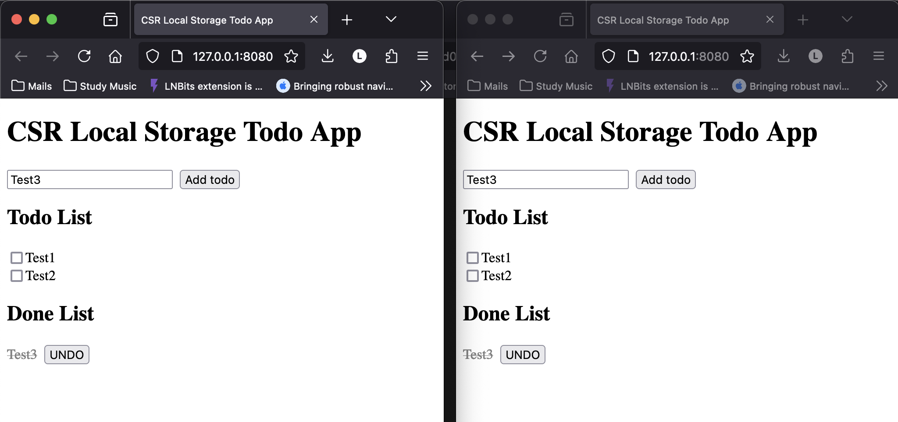

# Todo App with Leptos CSR and Local Storage

This is a very simple Todo App in Leptos that demonstrates how to use local storage in a CSR app without using any external dependencies.

## Running the App

* Set up rust nightly with `rustup override set nightly`
* Run `trunk serve --open `